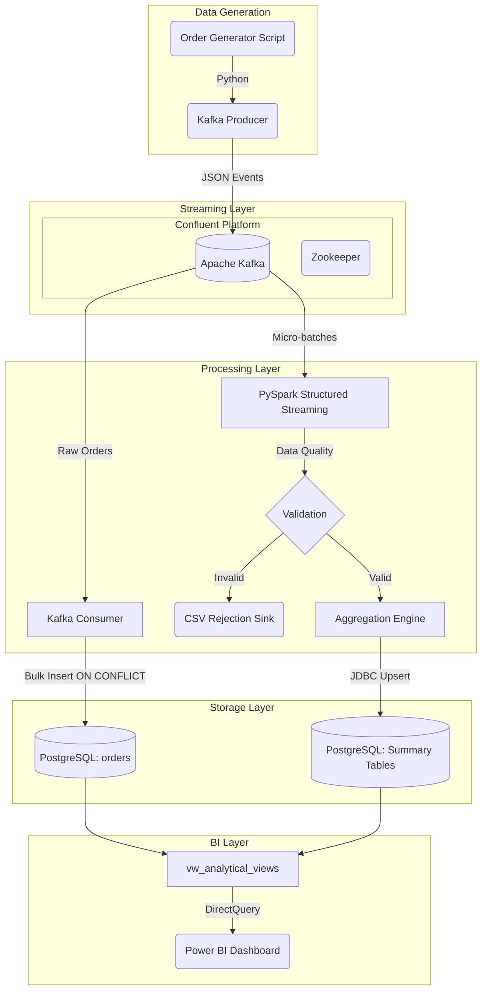

# Real-Time Food Delivery Analytics Pipeline


A production-grade Data Engineering project simulating a modern food delivery platform (like Swiggy or Zomato). It ingests, processes, and visualizes live order data in real-time.

## 🚀 Project Overview

The system architecture continuously generates synthetic food tracking orders, pushes them via an idempotent Kafka producer, consumes them concurrently, streams aggregations through Apache Spark, and stores metrics into PostgreSQL optimized for Power BI DirectQuery dashboards.

### Architecture



---

## 🛠️ Technology Stack

- **Data Generation:** Python (Faker, Click)
- **Message Broker:** Apache Kafka (Confluent cp-kafka), Zookeeper
- **Stream Processing:** PySpark (Structured Streaming 3.5.1)
- **Database / Data Warehouse:** PostgreSQL 16 (Idempotent upserts, analytical views)
- **Visualization:** Power BI (DirectQuery, SQL-driven KPIs)
- **Containerization:** Docker & Docker Compose
- **Configuration Management:** `python-dotenv`, dataclasses
- **Orchestration / Scheduling:** Apache Airflow (DAGs provided for daily aggregation / testing)
- **Testing:** Pytest

---

## 📁 Repository Structure

```text
food-delivery-pipeline/
│
├── .env                    # Environment configurations (Kafka, DB, Spark)
├── requirements.txt        # Pinned Python package dependencies
├── config.py               # Centralised typed configuration manager
│
├── docker/                 # Container infrastructure
│   ├── docker-compose.yml  # Kafka, ZK, Postgres, Kafka-Init
│   └── postgres/init.sql   # Database initialization scripts
│
├── database/               # PostgreSQL Setup
│   ├── schema.sql          # 5 core tables, 7 analytical views, indexes
│   └── seed_data.sql       # Initial seed records for dashboard config
│
├── producer/               # Data Ingestion
│   ├── order_generator.py  # Synthetic Swiggy/Zomato order creator
│   └── producer.py         # Fault-tolerant Kafka publisher
│
├── consumer/               # Light Data extraction
│   └── consumer.py         # Read from Kafka -> Bulk load into Postgres
│
├── spark/                  # Real-time Stream Processing
│   ├── spark_streaming.py  # Entry point. 7 parallel streaming queries
│   ├── transformations.py  # Pure PySpark transformations + DQ filtering
│   └── db_writer.py        # JDBC foreachBatch Postgres sinks
│
├── utils/                  # Shared Utility Modules
│   ├── logger.py           # Color-coded stream rotating logger
│   ├── db_utils.py         # Retry-backed database connections
│   └── validators.py       # Strict business-rule validations
│
├── dashboards/             # BI Layer
│   ├── sample_queries.sql  # SQL queries specifically for Power BI visuals
│   └── powerbi_setup.md    # Markdown guide to bootstrapping dashboards
│
├── airflow/                # Batch Orchestration
│   └── dags/               # Nightly batch rollups & hourly Data Quality
│
├── scripts/                # Execution Helpers
│   └── run_spark.sh        # Executes Spark with required packages
│
└── tests/                  # Test Suite
    ├── test_order_generator.py
    ├── test_producer.py
    └── test_validators.py
```

---

## ⚙️ Installation & Setup Guide

### 1. Prerequisites

- Python 3.9+
- Docker & Docker Compose
- Apache Spark (if running scale processing locally)
- Java 11 (required for PySpark)
- Power BI Desktop (for visualization)

### 2. Environment Setup

```bash
# Clone the repository
git clone https://github.com/yourusername/food-delivery-pipeline.git
cd food-delivery-pipeline

# Create and activate virtual environment
python -m venv venv
source venv/bin/activate  # On Windows: venv\Scripts\activate

# Install dependencies
pip install -r requirements.txt
```

### 3. Launch Docker Infrastructure

Start Kafka, Zookeeper, and PostgreSQL and automatically initialize the schema and Kafka topics.

```bash
cd docker
docker-compose up -d
```

Check logs to ensure the topic `food_orders` and Postgres database are created successfully.

### 4. Running the Pipeline Components

You must run these in separate terminal windows (with the `venv` activated).

**Terminal 1: Start PySpark Structured Streaming**
```bash
# Run via helper script (downloads JDBC + Kafka packages automatically)
chmod +x scripts/run_spark.sh
./scripts/run_spark.sh
```

**Terminal 2: Start the Kafka Consumer**
```bash
# Runs the consumer fetching messages and storing valid ones directly to PostgreSQL
python -m consumer.consumer
```

**Terminal 3: Start the Order Producer**
```bash
# Generate infinite synthetic data with a 5% invalid-record fault injection rate
python -m producer.producer --inject-faults
```

### 5. Verify the Data Pipeline

Once the producer runs, you should observe:
1. Producer logs confirm publishing to Kafka.
2. Consumer logs indicate batch ingestion to Postgres (`orders` table).
3. Spark logs updating 4 summary UI tables + printing KPIs to the console.
4. Rejected/Invalid events outputting to `output/rejected_records/spark_rejected/`.

You can query the database directly to confirm:
```bash
docker exec -it food_delivery_postgres psql -U pipeline_user -d food_delivery_db

-- Run test queries
SELECT * FROM vw_overall_kpis;
SELECT city, total_revenue FROM city_sales_summary ORDER BY total_revenue DESC;
```

---

## 📊 Dashboard Display (Power BI)

Power BI connects directly to PostgreSQL via ODBC/Npgsql. See `dashboards/powerbi_setup.md` for specific instructions and `dashboards/sample_queries.sql` for the pre-built visual queries.

### Dashboard Capabilities:
* **Real-time KPIs**: Overall Revenue, Average Order Value, Valid Order Count.
* **Geographical Sales**: Heat maps and Bar matrices grouped by 10 cities.
* **Item Popularity**: Treemap hierarchy sorting top-selling 20 items.
* **Logistics Tracking**: Donut charts showing Delivered vs Pending vs Cancelled status.
* **Transaction Distribution**: Cash On Delivery vs Cards vs UPI splits.

*Placeholder:*


---

## 🧪 Testing

The repository runs with comprehensive unit-tests covering business logic generation, validation strictness, and mocked infrastructure components.

```bash
# Run pytest with coverage report
pytest --cov=. tests/
```

---

## 🚀 Advanced / Future Enhancements

1. **Airflow Orchestration**: The `airflow/dags` folder contains pipelines ready to be executed on an Airflow cluster to schedule overnight aggregations and hourly DQ alerting.
2. **Cloud Migration**:
   - Push Spark streams to S3/GCS.
   - Replace local PostgreSQL with Snowflake (using Snowflake Spark Connector).
   - Change local Kafka to Confluent Cloud/Amazon MSK.
3. **Machine Learning**: Predict 'Probability of Cancellation' during the Spark streaming process based on time and item data.

---

> Built as a comprehensive, end-to-end Data Engineering Portfolio Project executing production-level engineering workflows.
# BIGDATA-ETL-PIPELINE-PROJECT

# BIGDATA-ETL-PIPELINE-PROJECT

